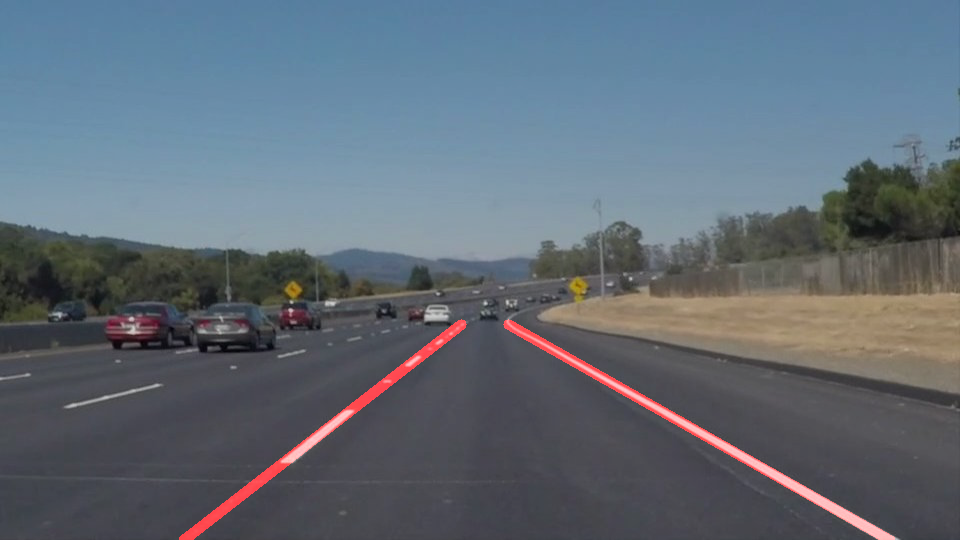

# **Finding Lane Lines on the Road** 

## Writeup 

---

**Finding Lane Lines on the Road**

The goals / steps of this project are the following:
* Make a pipeline that finds lane lines on the road
* Reflect on your work in a written report

[//]: # (Image References)

---

### Reflection

### 1. Describe your pipeline. As part of the description, explain how you modified the draw_lines() function.

My pipeline consisted of 5 steps. 
First, I convert the images to grayscale. Then I apply a Gaussian Smoothing and apply the Canny Edge Detection with roughly the same Parameters as in the lecture. After the edge detection I pick the region of interest which is a quadrilateral similar to the quadrilateral from the lecture. Afterwards, I detect lines with the Hough Tramsform and combined them with the original image.

For drawing two single lines, I modified the draw function in the following way: I separated lines on the left an right by the sign of their slope. Then, I executed for each grpup of lines (left lines, right lines) a least square fit where I fitted the endpoints of the lines to a linear function. I used the length of a line as weighting parameter to ensure that long lines have a bigger influence on the resulting line. Finally, I computed the end points of the resulting lines in such a way that they are at the end of the region of interest. In the following, the final result and steps inbetween of the first image is given while the other images can be found in the folder "test_images". In the first image, the image after the edge detection is given. The 2nd image shows the region of interest. The third image gives the final result. The video output can be found in the folder "test_videos_output"

### 2. Identify potential shortcomings with your current pipeline

A potential shortcoming is that the region of interest and the parameters used for the image modification are static which means that the line detection might not work for all images.
For example, the picked region of interest might be to big and additional lines are detected. The two resulting lines on the right and the left would be averaged with line segments from two different lines which would lead to a wrong result. 

Another shortcoming is that other parts of the images which are no lane lines are detected as part of the lane lines, for example shadow lines. This false detection leads to a wrong computation of the lane lines. You can observe this behavior especially in videos where the algorithm is not robust under certain conditions.

### 3. Suggest possible improvements to your pipeline

A possible improvement would be to modify the lane line detection algorithm, for example enrich it with color information, gradient direction,... 
For videos, a possible improvement would be to use the information from previous frames.
